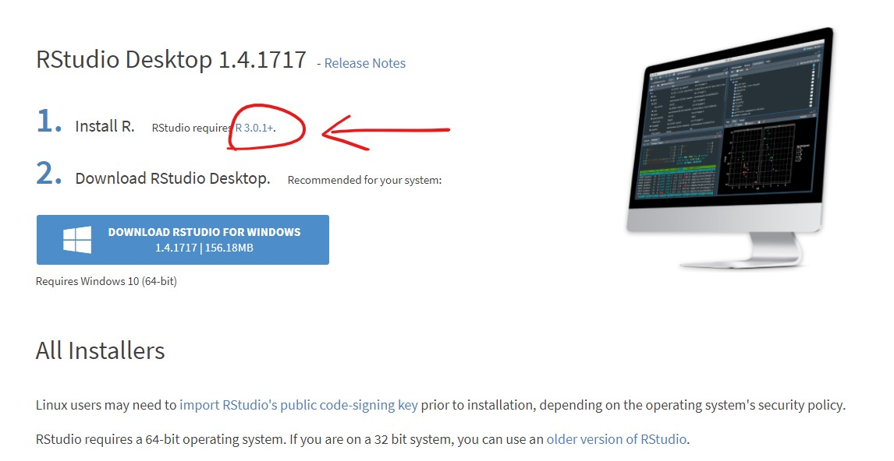
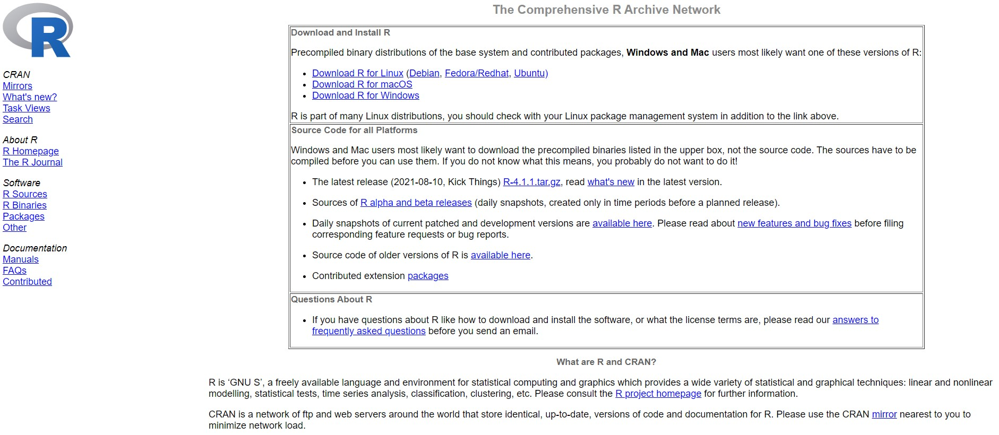
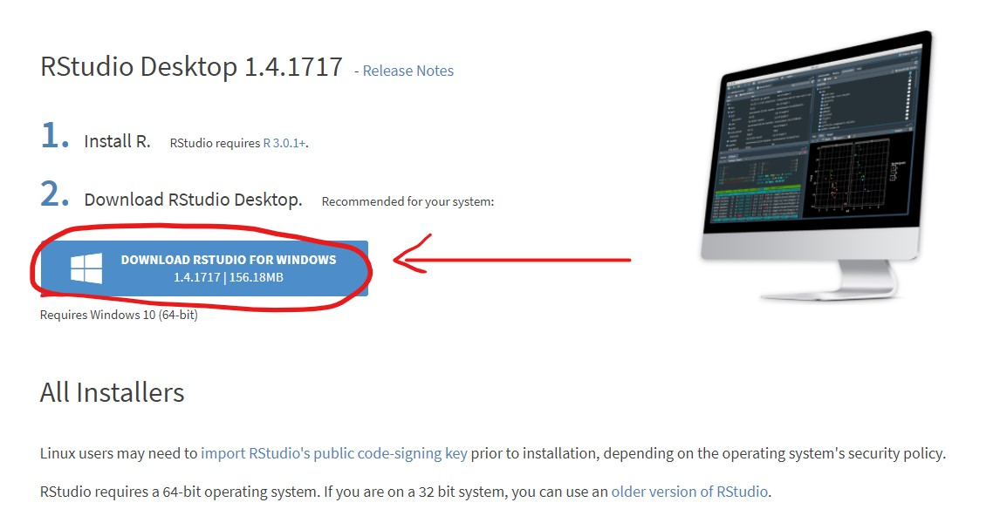

# Introduction to R {#seminar1}

## Why R?

In this chapter we will discuss the basics of R programming.
R is a free software, used by millions in the field of statistics, data science, economics and many others.

[{width="600"}](https://www.facebook.com/Rmemes0/photos/a.1230204967031792/2971372822914989/)

The R programming language is an important tool for data related tasks, but it is much more.
Just like other programming languages, R has many additional packages, which can extend its basic functionality.
R has a great (probably the best) graphical tools to create your charts, and with shiny, you can easily build your minimalist web applications.
We will learn about data manipulation, analysis and how to create awesome reports, like dashboards.

## Setup {#layout}

You can download R and RStudio from the official site of [RStudio](https://www.rstudio.com/products/rstudio/download/#download).
Please install the appropriate version based on your OS, and do not forget that you also have to install R as well.

[{width="600"}](https://www.rstudio.com/products/rstudio/download/#download)

[{width="600"}](https://cran.rstudio.com/)

Run R's installer file after the downloading process is finished.
Next, we will also need the RStudio.

[{width="600"}](https://www.rstudio.com/products/rstudio/download/#download)

If the installation process of R and RStudio is finished, then we can open RStudio and start to learn the software.

## Bootstrap

To continue your app customisation journey, you'll need to learn a little more about the [Bootstrap](https://getbootstrap.com) framework used by Shiny.
Bootstrap is a collection of HTML conventions, CSS styles, and JS snippets bundled up into a convenient form.
Bootstrap grew out of a framework originally developed for Twitter and over the last 10 years has grown to become one of the most popular CSS frameworks used on the web.
Bootstrap is also popular in R --- you've undoubtedly seen many documents produced by `rmarkdown::html_document()` and used many package websites made by [pkgdown](http://pkgdown.r-lib.org/), both of which also use Bootstrap.

As a Shiny developer, you don't need to think too much about Bootstrap, because Shiny functions automatically generate bootstrap compatible HTML for you.
But it's good to know that Bootstrap exists because then:

-   You can use `bslib::bs_theme()` to customise the visual appearance of your code, Section \@ref(themes).

-   You can use the `class` argument to customise some layouts, inputs, and outputs using Bootstrap class names, as you saw in Section \@ref(action-buttons).

-   You can make your own functions to generate Bootstrap components that Shiny doesn't provide, as explained in "[Utility classes](https://rstudio.github.io/bslib/articles/theming.html#utility-classes)".

It's also possible to use a completely different CSS framework.
A number of existing R packages make this easy by wrapping popular alternatives to Bootstrap:

-   [shiny.semantic](https://appsilon.github.io/shiny.semantic/), by [Appsilon](https://appsilon.com/), builds on top of [formantic UI](https://fomantic-ui.com).

-   [shinyMobile](https://github.com/RinteRface/shinyMobile), by [RInterface](https://rinterface.com), builds on top of [framework 7](https://framework7.io), and is specifically designed for mobile apps.

-   [shinymaterial](https://ericrayanderson.github.io/shinymaterial/), by [Eric Anderson](https://github.com/ericrayanderson), is built on top of Google's [Material design](https://material.io/design) framework.

-   [shinydashboard](https://rstudio.github.io/shinydashboard/), also by RStudio, provides a layout system designed to create dashboards.

You can find a fuller, and actively maintained, list at <https://github.com/nanxstats/awesome-shiny-extensions>.

## Themes

Bootstrap is so ubiquitous within the R community that it's easy to get style fatigue: after a while every Shiny app and Rmd start to look the same.
The solution is theming with the [bslib](https://rstudio.github.io/bslib) package.
bslib is relatively new package that allows you to override many Bootstrap defaults in order to create an appearance that is uniquely yours.
As I write this, bslib is mostly applicable only to Shiny, but work is afoot to bring its enhanced theming power to RMarkdown, pkgdown, and more.

If you're producing apps for your company, I highly recommend investing a little time in theming --- theming your app to match your corporate style guide is an easy way to make yourself look good.

### Getting started

Create a theme with `bslib::bs_theme()` then apply it to an app with the `theme` argument of the page layout function:

```{r, eval = FALSE}
fluidPage(
  theme = bslib::bs_theme(...)
)
```

If not specified, Shiny will use the classic Bootstrap v3 theme that it has used basically since it was created.
By default, `bslib::bs_theme()`, will use Bootstrap v4.
Using Bootstrap v4 instead of v3 will not cause problems if you only use built-in components.
There is a possibility that it might cause problems if you've used custom HTML, so you can force it to stay with v3 with `version = 3`.

### Shiny themes

The easiest way to change the overall look of your app is to pick a premade "[bootswatch](https://bootswatch.com)" theme using the `bootswatch` argument to `bslib::bs_theme()`.
Figure \@ref(fig:theme) shows the results of the following code, switching `"darkly"` out for other themes.
