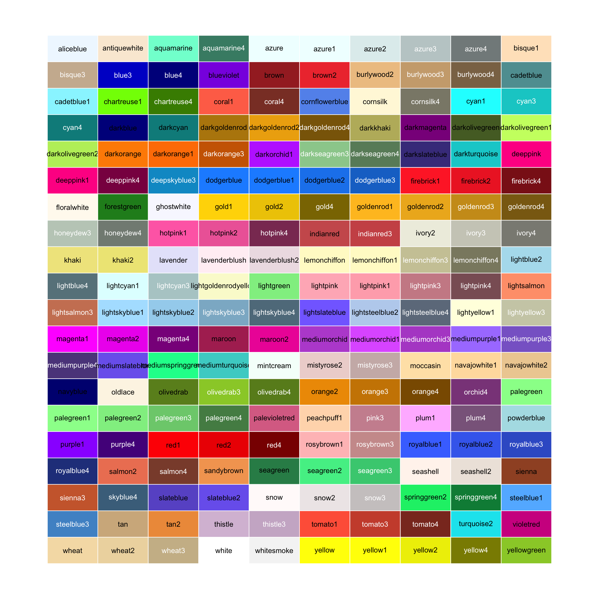

# Ggplot {#seminar4}

## Motiváció a ggplot package használatához

Bár maga a base R [értve itt ilyenkor mindig a `plot` paranccsal készült ábrákat] segítségével is lehet ábrákat készíteni, ez az egyszerűségét leszámítva nagyon ritkán ajánlott. Helyette érdemes a ggplot2-t alkalmazni, amely bár komplexebb, mint a base R, a személyre szabhatóságának szinte nincs felső határa.


Ám amelett, hogy szebb ábráink lesznek van egy sokkal fontosabb ok, amiért a ggplotot használjuk. A csomag a nevét Leland Wilkinson **Grammar of Graphics** c. munkája után kapta (innen a *gg*), amelyben megfogalmazásra került lényegében az ideális ábrakészítő algoritmus struktúrája. Mivel a ggplot2 ezt az elvet követi, így meglátjátok majd, hogy bár sok dolgot kell fejben tartani, minden logikus benne. Miután sikerül elsajátítani ezt az anyagot (és némi utána olvasás után) bármilyen szükséges ábrát el fogtok tudni készíteni.

## Bevezetés

A ggplot2 telepíthető önállóan is, illetve ez a csomag része egy "csomaggyűjteménynek", amit `tidyverse`-nek hívnak. Jelenleg mi csak a ggplot2-vel fogunk foglalkozni, így annak telepítése és betöltése is bőven elegendő lesz. Így annak függvényébne, hogy le van-e már töltve a package telepítsük [`install.packages("ggplot2")`], vagy ne, majd töltsük be [`library(ggplot2)`]. A ggplot2 helyett lehet egyből a `tidyverse`-t is betölteni, azonban jelenleg a többi package redundáns nekünk.

```{r}
library(ggplot2)
```


A ggplot2-vel kapunk néhány kiegészítő adattáblát, az egyszerűség kedvéért használjuk most ezek közül a `diamonds`-t. Pillanatra tekintsük meg az adattábla felépítését:

```{r eval = F}
head(diamonds)
```

```{r echo = F}
diamonds %>% 
  head %>% 
  gt %>% 
  tab_header("A diamonds adattábla")
```

Lássuk az első ábránkat ggplottal!

```{r fig.cap="A legelső ábránk ggplot használatával"}
ggplot(data = diamonds, mapping = aes(x = carat, y = price)) +
  geom_point()
```

Amit látunk, hogy az ábrázolás a `ggplot` paranccsal kezdődik. Itt definiálni kell, hogy melyik táblának adatait szeretnénk felhasználni (`diamonds`), majd pedig az ábrázoláshoz használt “keretet”, ami az `aes`-es belül kap helyet. Itt általában (mint például most) az x és y tengelyen ábrázolt adatokat kell megadni. A ggplot-ot mindig egy `geom` parancs követi, amellyel az ábra típusát adjuk meg.

Ezen az ábrán azonban még nicsen semmilyen felirat. Minden felirat megadható a `labs()` függvényben. Példa:

```{r fig.cap="Feliratok elhelyezése az ábrán"}
ggplot(data = diamonds, mapping = aes(x = carat, y = price)) +
  geom_point() +
  labs(
    title = "Figyelemfelkeltő cím",
    subtitle = "Az alcím pontosítja a témát",
    x = "x-tengely váltózójának neve",
    y = "y-tengely változójának neve",
    caption = "Mindent megmagyarázó hosszú leírás."
  )
```


## Esquisse

Első látásra ez még lehet túl sok információ, illetve a következőkben a bonyolultabb ábrákra rátérve elveszítheti az ember a fonalat. Amíg bizonytalan a ggplot használata javaslom a `esquisse` packaget Ezt csupán telepíteni kell a `install.packages("esquisse")` paranccsal, majd az `Addins` menüből lehet előhívni. Ennek segítségével "manuálisan" adhatóak meg az ábra elemei. Lássuk például az előző ábrát!

```{r eval=knitr::is_html_output(), results='asis', echo=FALSE}
cat('')
```

## Szín

Az `esquisse` automatikusan hozzáadott 3 elemet, amit akkor itt tisztázni szükséges. A `geom` függvényen belül a `size` paraméter a pontok méretért felel, míg a `color` a pontok színéért. Színként megadható bármilyen hexadecimális érték, illetve az R számos színt ismer (`red`, `green`, `blue`, `black`, stb.).

```{r fig.cap="Néhány példa az elérhető színekre", echo = F}

```

## Téma

A 3. dolog amit `esquisse` csatolt a kódunk mellé az egy `theme` parancs. Ez a parancstípus az ábra hátterének, jelmagyarázatának és feliratainak esztétikáját adja meg. Lássunk ezekből is néhányat!

```{r eval = F}
ggplot(data = diamonds, mapping = aes(x = carat, y = price)) +
  geom_point() +
  theme_bw()

ggplot(data = diamonds, mapping = aes(x = carat, y = price)) +
  geom_point() +
  theme_classic()

ggplot(data = diamonds, mapping = aes(x = carat, y = price)) +
  geom_point() +
  theme_grey()

ggplot(data = diamonds, mapping = aes(x = carat, y = price)) +
  geom_point() +
  theme_minimal()
```

```{r animation.hook="gifski", eval = knitr::is_html_output(), fig.cap="Néhány elérhető téma", echo=F}
p <- ggplot(data = diamonds, mapping = aes(x = carat, y = price)) +
  geom_point()

p + theme_bw() + ggtitle("theme_bw")
p + theme_classic() + ggtitle("theme_classic")
p + theme_grey() + ggtitle("theme_grey")
p + theme_minimal() + ggtitle("theme_minimal")
```

```{r eval = knitr::is_latex_output(), fig.cap="Néhány elérhető téma", echo=F}
p <- ggplot(data = diamonds, mapping = aes(x = carat, y = price)) +
  geom_point()

((p + theme_bw() + ggtitle("theme_bw")) +
(p + theme_classic() + ggtitle("theme_classic"))) /
((p + theme_grey() + ggtitle("theme_grey")) +
(p + theme_minimal() + ggtitle("theme_minimal")))
```

Persze van még rengeteg, válogass nyugodtan: https://www.datanovia.com/en/blog/ggplot-themes-gallery/

Ami még fontos, hogy a `theme()` függvénnyel módosíthatóak a témánk egyes elemei (háttérszín, betűszín stb.). Például legyen tényleg figyelemfelkeltő a fentebb bemutatott cím!

```{r fig.cap="Téma egy elmének megváltoztatására példa"}
ggplot(data = diamonds, mapping = aes(x = carat, y = price)) +
  geom_point() +
  labs(
    title = "Figyelemfelkeltő cím",
    subtitle = "Az alcím pontosítja a témát",
    x = "x-tengely váltózójának neve",
    y = "y-tengely változójának neve",
    caption = "Mindent megmagyarázó hosszú leírás."
  ) + 
  theme(
    plot.title = element_text(color = "red", size = 30)
  )
```

## Geom

A plot szempontjából lényeges fontosabb azonban a `geom` függvény. Maga a függvény adja meg az ábra típusát, azonban a benne foglalt paraméterek sem elhanyagolhatóak. Nézzük példát a típusokra (csak párat van módom említeni a végtelenül sokból)!

```{r eval = F}
ggplot(data = diamonds, mapping = aes(x = carat)) +
  geom_histogram()

ggplot(data = diamonds, mapping = aes(x = carat)) +
  geom_histogram() + 
  geom_vline(xintercept = mean(diamonds$carat), color = 'red4')

ggplot(data = diamonds, mapping = aes(x = cut)) +
  geom_bar()

ggplot(data = diamonds, mapping = aes(x = carat, y = price)) +
  geom_point()
```

```{r echo = F, fig.cap = 'Példák ábratípusokra' }
(ggplot(data = diamonds, mapping = aes(x = carat)) +
   geom_histogram() + ggtitle("geom_histogram") +
   ggplot(data = diamonds, mapping = aes(x = carat)) +
   geom_histogram() + 
   geom_vline(xintercept = mean(diamonds$carat), color = 'red4') +
   ggtitle("geom_vline")) / 
  (ggplot(data = diamonds, mapping = aes(x = cut)) +
     geom_bar() +
     ggtitle("geom_bar") +
     ggplot(data = diamonds, mapping = aes(x = carat, y = price)) +
     geom_point() +
     ggtitle("geom_point"))
```
A 2. kódból látszik, hogy több `geom` is tartozhat egyszerre egy ábrához, így lehet például egy hisztogramon feltüntetni az átlagot egy függőleges vonallal (`geom_vline`). Ennek párja is rendkívül hasznos tud lennni a `geom_hline`, amivel lehet akár 0 mentén húzni egy vízszintes vonalat. A `cut` egy kategorikus változó az adattáblánkban, amelynek az egyes kategóriákhoz tartozó darabszámait egy `geom_bar`-al gyorsan kirajzolhatjuk.
Most nézzük a paramétereket! Eddig láttunk példát a `size`-ra és a `color`-ra, ami majdnem minden geom esetén csinál valamit, de egyes geomoknak vannak speciális paramétereik is, mint pélául az előbbi példában az `xintercept`. Lássunk néhány további fontos paraméterre példákat:

```{r echo = F}
tibble(Paraméter = c('fill', 'alpha', 'ltp', 'shape'), Jelentés = c('kitöltés színe', 'átlátszóság', 'vonal szaggatásának típusa', 'alak típusa')) %>% 
  gt  %>% 
  cols_align(
    align = "center"
  )
```

```{r eval = F}
ggplot(data = diamonds, mapping = aes(x = carat)) +
  geom_histogram(color = 'black', fill = "red")

ggplot(data = diamonds, mapping = aes(x = carat)) +
  geom_vline(xintercept = mean(diamonds$carat), lty = 2)

ggplot(data = diamonds, mapping = aes(x = cut)) +
  geom_bar(alpha = .3)

ggplot(data = diamonds, mapping = aes(x = carat, y = price)) +
  geom_point(shape = 21, color = 'black', fill = 'green')
```

```{r echo = F, fig.cap = 'Példák geom paraméterre'}
(ggplot(data = diamonds, mapping = aes(x = carat)) +
   geom_histogram(color = 'black', fill = "red") + ggtitle('fill') +
   ggplot(data = diamonds, mapping = aes(x = carat)) +
   geom_vline(xintercept = mean(diamonds$carat), lty = 2) + ggtitle('lty'))/
  (ggplot(data = diamonds, mapping = aes(x = cut)) +
     geom_bar(alpha = .3) + ggtitle('alpha') +
     ggplot(data = diamonds, mapping = aes(x = carat, y = price)) +
     geom_point(shape = 21, color = 'black', fill = 'green') + ggtitle('shape'))
```

Az utolsó ábra itt még igényel némi magyarázatot. A pont diagram alapbeállítása szerint csak `color` paraméter adható meg. Azonban ha a `shape`-t átállítjuk, akkor van lehetőségünk olyan pontdiagramokat rajzolni, amelyeknek belsejéhez tartozó színt adja meg a `fill`, a szegélyét a `color`.

## Aes

Korábban csak átsiklottunk az `aes()` függvényen, ami az ábra "keretét" adta. Most nézzük meg kicsit részletesebben! A `mapping` paraméter, aminek megadásához használjuk fel az `aes()`-t az előzőekben a `ggplot()` függvényen belül szerepelt. Ennek azonban nem kell feltétlenül így lennie. A következő 3 kód, mind ugyanazt hajtja végre (erre még visszatérünk):

```{r eval = F}
ggplot(diamonds, aes(x = carat, y = price)) +
  geom_point()

ggplot(diamonds) +
  aes(x = carat, y = price) +
  geom_point()

ggplot(diamonds) +
  geom_point(aes(x = carat, y = price))
```

Az `aes`-ben azonban nem csak x- és y-tengely változóit definiálhatjuk. Minden ami `geom`-beni paraméter, az megadásra kerülhet az `aes()`-ben is, azonban ilyenkor az adott változó értéke szerint kerül megadásra (pl.: egy harmadik változó szerint van definiálva a méret, vagy a szín). Ami paraméter az `aes()`-ben kerül megadásra, az automatikusan a jelmagyarázatra is felkerül. Lássunk két példát!

```{r eval = F}
ggplot(diamonds, aes(x = carat, y = price, color = cut)) +
  geom_point()

ggplot(diamonds, aes(x = carat, y = price, size = cut)) +
  geom_point(alpha = .3)
```

```{r echo = F, fig.height = 10, fig.cap = "Extra változó felvétele az aes()-be"}
(ggplot(diamonds, aes(x = carat, y = price, color = cut)) +
   geom_point()) /
  (ggplot(diamonds, aes(x = carat, y = price, size = cut)) +
     geom_point(alpha  =.3))  
```

Ha egy változó szerint adjuk meg a színeket, akkor érdemes a színezésnek módját is megadni. Erre leginkább a `viridis` függvények a javasoltak (számos alkalommla láthatod tudományos publikációkban + *végződésre figyeljünk: viridis_d, mint diszkért/viridis_c, mint folytonos*), de ha például fontos, hogy fekete-fehér legyen, arra is van mód, illetve "kézileg" is meg lehet adni színeket.

```{r eval = F}
ggplot(diamonds, aes(x = carat, y = price, color = cut)) +
  geom_point()

ggplot(diamonds, aes(x = carat, y = price, color = cut)) +
  geom_point() +
  scale_color_viridis_d(option = "magma")

ggplot(diamonds, aes(x = carat, y = price, color = cut)) +
  geom_point() + 
  scale_color_manual(
    values = c("red", "green", "blue", "yellow", "orange")
    )
```

```{r echo = F, fig.cap="Kitöltési opciók", fig.height=10}
(ggplot(diamonds, aes(x = carat, y = price, color = cut)) +
   geom_point()) /
  (ggplot(diamonds, aes(x = carat, y = price, color = cut)) +
     geom_point() +
     scale_color_viridis_d(option = "magma")) /
  (ggplot(diamonds, aes(x = carat, y = price, color = cut)) +
     geom_point() + 
     scale_color_manual(values = c("red", "green", "blue", "yellow", "orange")))
```
És most vissza oda, hogy miért is hasznos, hogy több `aes()` definiálható egyetlen ábrán. Elképzelhető, hogy két külön `geom`-ot használunk együtt. Legyen mondjuk egy pontdiagram és egy azokra illesztett "trendvonal". Utóbbi a `geom_smooth` paranccsal érhető el, s amennyiben lineáris függvény formára vágyunk (yes), úgy adjuk meg neki a `method = "lm"` paramétert.

```{r fig.cap =  "Lineáris trend illesztése pontdiagramra"}
ggplot(diamonds, aes(x = carat, y = price, color = cut)) +
  geom_point() + 
  geom_smooth(method = "lm")
```

Mint látjuk jelen esetben a `geom_smooth` ugyanazt az `aes()`-t alkalmazza, mint a `geom_point`. Ez azonban problémás, ha nem akarunk a kategorikus ismérv mentén 5 külön trendvonalat illeszteni. Ilyenkor jelent megoldás egy új `aes()` megadása egyetlen ábrán belül.

```{r fig.cap =  "Lineáris trend illesztése pontdiagramra két külön esztétika függvénnyel"}
ggplot(diamonds) +
  geom_point(aes(x = carat, y = price, color = cut)) + 
  geom_smooth(aes(x = carat, y = price), method = "lm")
```

## Facet

A `facet` az utolsó parancs amit érinteni kívánunk. Ennek segítségével lehetőség van egy ábra felosztására valamely változó mentén. Például a `cut` változó szerint csoportosítva megtekintve a pontdiagramok:

```{r fig.cap="Facet alkalmazása egy változó szerint"}
ggplot(diamonds, aes(x = carat, y = price)) +
  geom_point() +
  facet_wrap(~ cut)
```
Ha pedig soronként és oszloponként is akarunk csoportosítani:

```{r fig.cap="Facet alkalmazása két változó szerint", fig.height=12}
ggplot(diamonds, aes(x = carat, y = price)) +
  geom_point() +
  facet_grid(color ~ cut)
```

## Kitekintés

A ggplot2 logikusan felépített működése annyira a felhasználók kedvencévé tette, hogy számos kiegészító package épült rá: `ggpubs`, `GGally`, `gganimate`, stb. Ezek jelenleg nem részei a tananyagnak, azonban érdemes rájuk nézni, ha szakdolgozat vagy TDK prezentálása során szeretnéd lenyűgözni a közönséged. Kedvcsináló: 

```{r, eval=knitr::is_html_output(excludes = "epub"), results = 'asis', echo = F}
cat(
'<iframe width="560" height="315" src="https://www.youtube.com/embed/SnCi0s0e4Io" frameborder="0" allow="accelerometer; autoplay; clipboard-write; encrypted-media; gyroscope; picture-in-picture" allowfullscreen></iframe>'
)
```