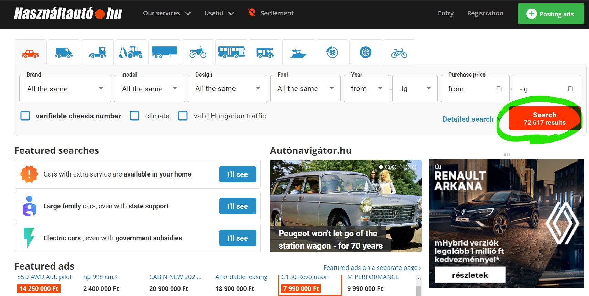

# Webscraping with R {#seminar5}

Nowadays, we manage a very huge part of our life online. This has an important side-effect: we can collect enormous data from the web for our researches. You can access data about shops, blogs, social media etc. The target of this chapter is to give a brief introduction how you can collect this data effectively. We will need a new package for this purpose: `{rvest}`

```{r}
library(rvest)
```

We will scrape the data from [hasznaltauto](https://www.hasznaltauto.hu/), which is the online second hand car market of Hungary. Lets navigate to the page in our browser and lets click on search.

```{r fig.cap="www.hasznaltauto.hu/", echo=FALSE}

```

Now we have to copy and paste the new url from the browser to Rstudio. This will be the first link we want to visit while scraping. Lets assign this url as `url` in R.

```{r echo = FALSE}
url <- "https://www.hasznaltauto.hu/talalatilista/PCOG2VGRR3RDADH4S56ACFGY3UFY652CQ52EEK45WSXZLINGQQTDCSWSNIA7D37HWSSTIHCPWUTHMPA6J4FHF5RBV5PE4MZJFIEFRESTWDAUMLAZTNFOCL3IKCP2CDWUIJZSSQFHRGNR4PZIK5QEBX2AAH7CFFS3HHUS62IY23QHFI3MT47ANYN3A4LVEYHN6L73HHYPQ2FNRFL3LHICCP4CGN24WUMKNH5X3F5CAQDXNJ2AFP7SEIML6OASN67CRR5W5UNBHZQKAF6HYO6LJATDQAR7JDBGKLWJSJBLWAXOQMLMR6SQUDHAPUPCN3GQ245PRWED3FSZHNWZY6Z3QP553M73IYIJP2J4DP7IDK2UHH3I6N4TQO5SL6VMBHSNY2GXPNIPMT7CQHZ6DUMQVCXMXLUI5X62VKX7LJU7WYR7AQYK4VL25K2RWZOCSHOQOUKUZTUAVMQFP7IVTRWKQQFNA6CFHAR22X7IQOS6Y4NN33MFBVFQWIOVMUAEPOSUVJISDFTP7LC63WMREFKGMVE2UD3VUZSTWOD4DHVBDRXAHLPBIRASYQJO4RKXKRTNK6V6JNELWMMGOXJ4RPY2ZC7HGGPHP4KCFRXRZTCYGO2CLOW2RUTUTYOBWNOMPDVBFJT6WGLYKCXTK6SMKCTM5CTJGQL2UISVZ25LMYWG25UCBQDYI6OEZXS7FL3GYNOG37ROU2FPX2JYKMUKDKVRBV7POPMGUSEKMIHV3MZ7VV5IEA42KPWJ3XGWX2R6RPSLIX3NZDGPLACPJJZHUIGVSOUQUNZIZP3XX4CH5L3DSTWV22LFSJI6HQ7GNZUM72HTHW4RFNAZ6G6HKIVTRV75DLRWNBDWI377ADB4ND5H"
```

```{r eval = FALSE}
url <- "https://www.hasznaltauto.hu/talalatilista/PCOG2VGRR3RDAD [...]" # long url
```

```{r fig.cap="Click on the search button.", echo=FALSE}
knitr::include_graphics("images/hasz_frist_click.gif")
```

The next step is load the website into your R session. This can be done by the `read_html` function from the `{rvest}` package.

```{r}
page <- read_html(url)

page
```

Now we can see the webpage as html codes in RStudio. This is the same what you get if you open developer view in your browser.

```{r fig.cap="Developer view in browser.", echo=FALSE}
knitr::include_graphics("images/dev_mode.png")
```

In the developer view, you can find the information that is relevant to you and select it using the `html_nodes` function. Alternatively, however, there is a simpler method. Add **Selector Gadget** to your browser. This add-on helps you find the ID of an item by clicking on it. This way, you can navigate without having web development skills. We can easily install this add-on in chrome and edge, just search for its name and the first hit should be this.

```{r fig.cap="Add Selector Gadget to your browser.", echo=FALSE}
knitr::include_graphics("images/selector_gadget_to_chrome.jpg")
```

You can activate the add-on from the menu of your browser.

First, find the IDs for the car ads. To do this, first select the name of a specific car and then mark everything you do not want to include. The target is to make every car ads title to yellow or green, but nothing else should be green.

```{r fig.cap="Using Selector Gadget to find IDs for the car ads.", echo=FALSE}
knitr::include_graphics("images/selector_gadget_to_use.gif")
```

If you have the ID you are looking for, put it in the `html_nodes` function. The code above selects the ad titles from the page.

```{r}
my_node <- page %>% 
  html_nodes(".cim-kontener a")

my_node
```

But this is still an html_code.If we want to keep the text of the element, we use the `html_text` function, but if we are interested in the url it points to, we use the` html_attr` function. In the latter case, it is always necessary to specify the `href` element, ie which web page you are referring to.

```{r}
name_of_the_car <- my_node %>% 
  html_text()

name_of_the_car
```

```{r}
url_to_car <- my_node %>% 
  html_attr("href")

url_to_car
```

We've now collected the names of all the ads and the url leading to them from the first page. The next step is to collect this data from all pages. However, downloading info from all sites is a lengthy process. **Always try the first few pages first and only download them all if you are sure that your program is running without error.**

But how do we download data from multiple pages at once? Let's see if the url changes when we go to the next page. 

If we look at the second page of the results list in the browser, we can see that the link has been expanded with a "/page2" member compared to our previous `url` address. Continue with "/ page3" on page 3, etc. 

This way we can easily generate a vector that contains the links to the first 1, 10, 100, 1000 or even all pages. Lets put these into a data.frame.

```{r}
url_ending <- str_c("/page", 2:10)

url_ending

url_ending <- c("", url_ending) # nothing to add at the first page

url_ending

cars_add_df <- tibble(url = str_c(url, url_ending))

cars_add_df
```

Taking advantage of the `{purr}` package, we can load and manipulate entire pages in data frames in a transparent and human-readable (**tidy**) way.

This will require the `map` function, but we haven't talked about using it so far.

`Map` is very similar to the functions of the apply family. It performs a specific function on each element of a list / vector, but the result always comes in the form of a list.

```{r}
map(1:5, ~ .^2) # calculate the square of each element (lambda type function)

map(1:3, rnorm, 10) # generate rnrom distribution with 1,2,3 element 
```

The second example shows that if we specify only one function as the second input, without "~" and ".", the first input of `map` will automatically be the first possible input for the specified function, and then the elements added after the function will follow in order. In the present case, we prepared random samples with 1, 2, and 3 elements, where the expected value of the samples is 10, because the first input of the function `rnorm` is the number of elements (n) and the second is the expected value (mean).

We will now use the `map` function inside the` mutate` function, so a list will actually be a column of the original table. The elements of this list will be the web pages that are loaded with the `read_html` function.

```{r}
cars_add_df %>% 
  mutate(
    page = map(url, read_html)
  )
```

Now let's insert a `nodes` column that contains only the required points of the page, and a` url_to_cars` column, which is the links extracted from it. Since this is already a computationally intensive step, it is worth saving the result. Save it with the same name so your environment won't be full of unnecessary variables.

```{r}
cars_add_df <- cars_add_df %>% 
  mutate(
    page = map(url, read_html),
    nodes = map(page, ~ html_nodes(., ".cim-kontener a")),
    ad_title = map(nodes, html_text),
    url_to_cars = map(nodes, html_attr, "href")
  )
```

```{r}
cars_add_df
```

From now on, all we need is a column with links and addresses, but these are nested. The first cell of the `url_to_cars` column contains more than a hundred links. This nesting option opens a lot of new doors in the process of data manipulation. Use the `unnest` function to extract these columns.

```{r}
cars_add_df %>% 
  select(url_to_cars, ad_title) %>% 
  unnest()
```

We can see that the nodes selection was not entirely perfect (usually not), as there were no matching elements or duplications left. 

But now we can still remove the items that don't fit here. Fortunately, there is no link behind these, and if all columns are the same, `unique`[^You can also use it on lists and vectors.] will be our service.

```{r}
cars_add_df <- cars_add_df %>% 
  select(url_to_cars, ad_title) %>% 
  unnest() %>% 
  na.omit() %>% # remove rows where url_to_cars is missing (NA)
  unique() # delete duplications

cars_add_df
```

We now have a ready-made list of available cars and their links. Let’s visit one in the browser to see what’s next.


```{r eval = F}
tables_form_page <- url_to_car %>% 
  na.omit() %>% 
  first() %>% 
  read_html() %>% 
  html_table(fill = TRUE) %>% 
  keep(~ ncol(.) == 2)

# apply

cars
apply(cars, 2, mean)
x <- 1:10
x
lapply(x, function(x) x^2)
sapply(x, function(x) x^2)
map(x, ~ .^2) # same with tidy method
map_dbl(x, ~ .^2)

# map

tables_form_page %>% 
  map(~ set_names(., "x", "y"))

tables_form_page %>% 
  map(~ set_names(., "x", "y")) %>% 
  bind_rows() # merge the tables

get_data <- function(url_to_car) {
  url_to_car %>% 
    read_html() %>% 
    html_table(fill = TRUE) %>% 
    keep(~ ncol(.) == 2) %>% 
    map(~ set_names(., "x", "y")) %>% 
    bind_rows()
}

get_data("https://www.hasznaltauto.hu/szemelyauto/suzuki/swift/suzuki_swift_1.2_dualjet_hybrid_gl_plusz-16320785")

url_to_car %>% 
  na.omit() %>% 
  head() %>% 
  map(get_data)

"https://www.hasznaltauto.hu/talalatilista/PCOG2VG3R3RDADH5S56ACFHGCYPHPBIGNGCUMWTJLYVUGTIJJVRJJJGVADRN7V3JJNUVRHTKDXN7DSPRJFA44PXEYXFWSJSFAUAUW4QK23MIQBLDKMU7YGIN5IJ5JAK2NAXAL2FUODG7ROYUDNVFJQAQHIQPMNQYKCB4XDNSJ5APR2OBC4U3A5XZ77KY7CNBQNE6ZQM7FXUJAH6ATG5KKJWFWT634SKRQIB3WVNASV7VFEGFNOASN6ZEY4ZTP2CQ54Y5BE3UTSWFZQMMPQBQK4YQROGZYJAZLLBCDQABPKXBGKLWJSPWWVYF3VS6RMKUTMA3ZXMUV7RNBVZ27A4J26LHSOLMN6ZDRVP553POVKYTRH3E6AX3URTN2ET2U7PNJ6HOZNZKWBTZH4PANXWQHGJ7ZKDS6R4GQIRLWKV26RV5X5N5LL3TU5AEH2SFA7XJXIPGLS5F2IA53YAFAOXIEXHVI5YLDIICWUPBALQJ5JMPWA7KPAOGW5HTDM3CYOUEKSLQCHHJKKUWQN65C6YTIO5WNAEJKGNVE3UK3F6Z2RWGVMBHFCD5GQDLHAJHWF7ERO6KQ3VF5XJJLHDWOELOHLELM4YZ45PRHTDPGLT6CGFSWBZT2YGG3CNOO3RZXJHQ4BTO4Y6HKCK3GKIN3SU5OGR5EYUFGZ6FGSNDGVMRFJLV2WRR4PZTIEDAXQRS4JXPZ4K3XOI24OXXC5NUKM74SQQZIWGVLCHL644WYNBEJVYYNLWZT5LD3QABZUY44TSONNPVQ5G7XERHW2WGHELAD7PRQFUEHFXW4SUBZY3P3XHYEX7SDBSXWV22THSKV4OJ6M2LIJ7U7GHFYCO2RR4F4O4R3HDL62K3DO2CHMWXP5T7RFKA/page2"  

url

many_urls <- c("", str_c("/page", 2:10))
many_urls

tibble(url = str_c(url, many_urls)) %>%
  sample_n(2) %>% 
  mutate(
    page = map(url, read_html),
    url_to_car = map(page, html_nodes, ".cim-kontener a"),
    car = map(url_to_car, html_text),
    url_to_car = map(url_to_car, html_attr, "href")
  ) %>% 
  select(car, url_to_car) %>% 
  unnest(cols = c(car, url_to_car)) %>% 
  filter(!is.na(url_to_car))

cars_df <- tibble(url = str_c(url, many_urls)) %>%
  mutate(
    page = map(url, read_html),
    url_to_car = map(page, html_nodes, ".cim-kontener a"),
    car = map(url_to_car, html_text),
    url_to_car = map(url_to_car, html_attr, "href")
  ) %>% 
  select(car, url_to_car) %>% 
  unnest(cols = c(car, url_to_car)) %>% 
  filter(!is.na(url_to_car))

cars_df %>% 
  sample_n(2) %>% 
  mutate(
    data = map(url_to_car, get_data)
  ) %>% 
  unnest(data) %>% 
  select(-url_to_car)

cars_data_df <- cars_df %>% 
  mutate(
    data = map(url_to_car, get_data)
  ) %>% 
  unnest(data) %>% 
  pivot_wider(names_from = x, values_from = y) %>% 
  janitor::clean_names()


safely_read_html <- possibly(read_html, NA, quiet = FALSE)

sleepy_read_html <- function(url) {
  page <- safely_read_html(url)
  
  for (i in 1:3) {
    if (is.na(page)) {
      Sys.sleep(2)
      message("I have to be patient! :)")
      page <- safely_read_html(url)
    }
  }
  
  page
}

get_data <- function(url_to_car) {
  page <- url_to_car %>% 
    sleepy_read_html()
  
  if (!is.na(page)) {
    
  page %>% 
    html_table(fill = TRUE) %>% 
    keep(~ ncol(.) == 2) %>% 
    map(~ set_names(., "x", "y")) %>% 
    bind_rows()
  } else {
    tibble(x = as.character(NA), y = as.character(NA))
  }
}

cars_data_df <- cars_df %>% 
  unique() %>% 
  mutate(
    data = map(url_to_car, get_data)
  ) %>% 
  unnest(data) %>% 
  pivot_wider(names_from = x, values_from = y) %>% 
  janitor::clean_names()
```
